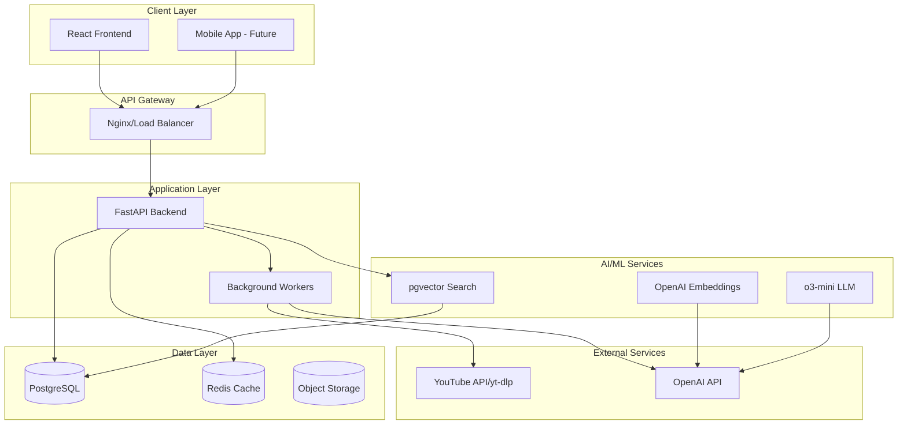
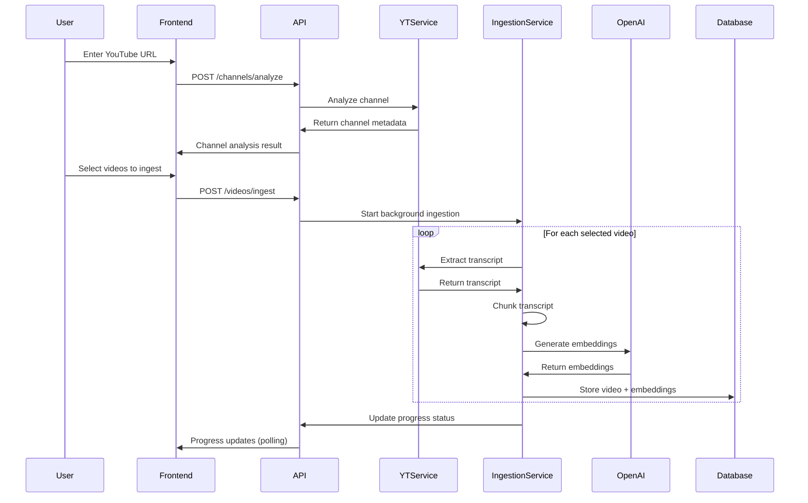
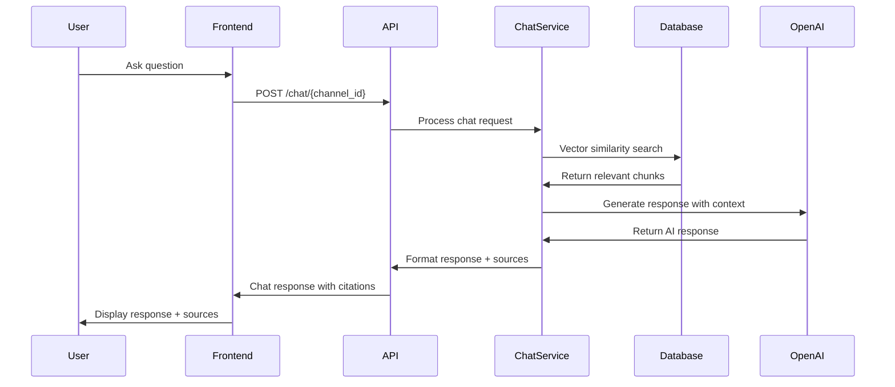
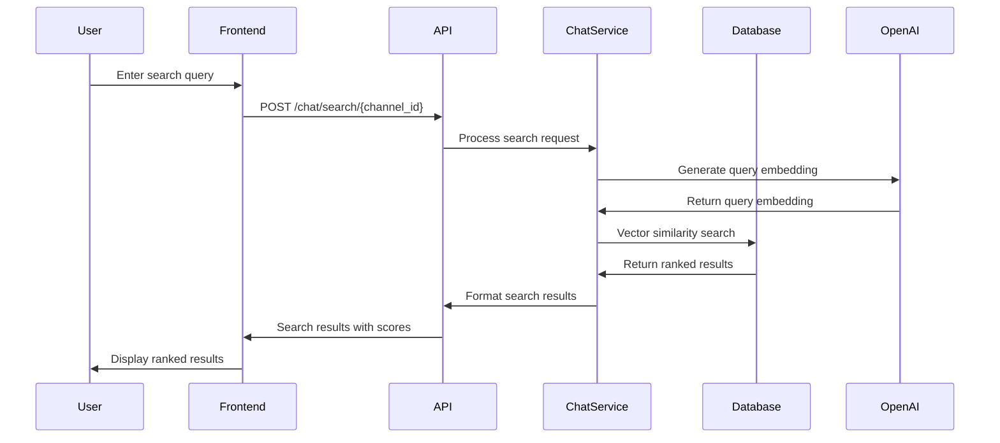
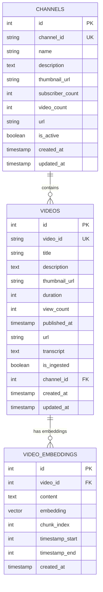
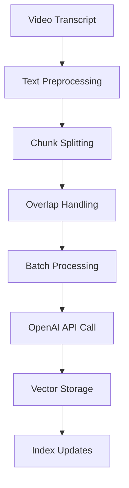
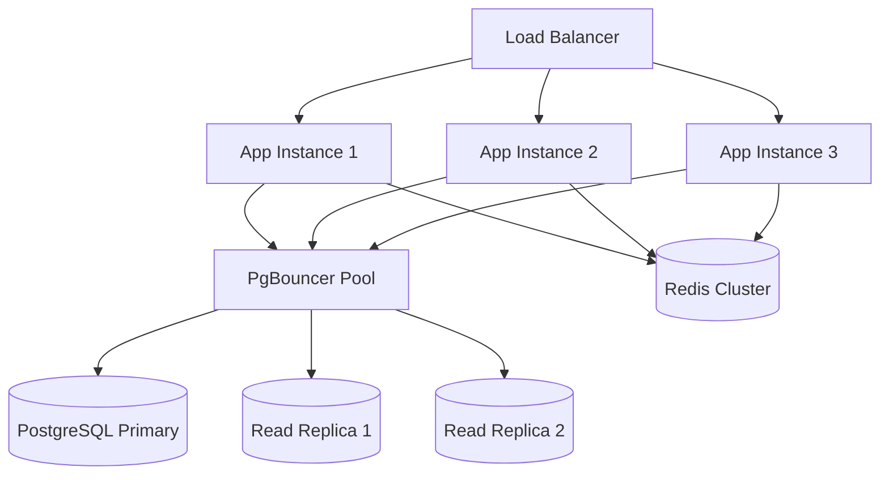
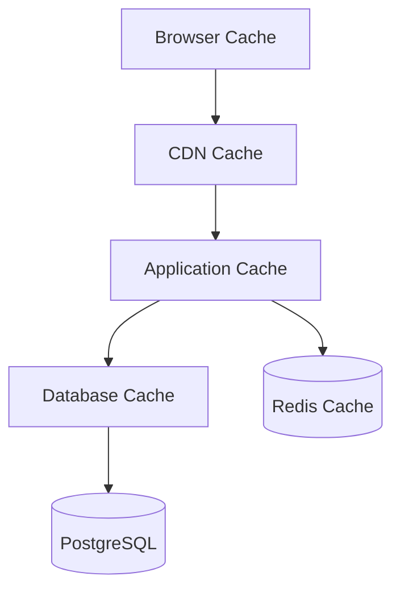

# Architecture Documentation

Detailed technical architecture documentation for the YouTube AI Library system.

## Table of Contents

- [System Overview](#system-overview)
- [Architecture Principles](#architecture-principles)
- [Component Architecture](#component-architecture)
- [Data Flow](#data-flow)
- [Database Design](#database-design)
- [API Architecture](#api-architecture)
- [Frontend Architecture](#frontend-architecture)
- [AI/ML Pipeline](#aiml-pipeline)
- [Security Architecture](#security-architecture)
- [Scalability Considerations](#scalability-considerations)
- [Performance Architecture](#performance-architecture)
- [Monitoring and Observability](#monitoring-and-observability)

## System Overview

### High-Level Architecture



### Technology Stack

**Frontend:**
- React 18 with TypeScript
- Tailwind CSS for styling
- Headless UI for components
- React Router for navigation
- Axios for HTTP client

**Backend:**
- Python 3.11 with FastAPI
- SQLAlchemy ORM with PostgreSQL
- pgvector for vector similarity search
- Celery for background task processing
- Redis for caching and task queue

**AI/ML:**
- OpenAI o3-mini for chat responses
- OpenAI text-embedding-3-small for embeddings
- pgvector for semantic similarity search
- LangGraph SDK for workflow orchestration

**Infrastructure:**
- Docker containers for deployment
- PostgreSQL 16 with pgvector extension
- Nginx for reverse proxy and load balancing
- Redis for caching and session storage

## Architecture Principles

### Design Principles

1. **Separation of Concerns**
   - Clear boundaries between presentation, business logic, and data layers
   - Modular component design for maintainability
   - Service-oriented architecture for scalability

2. **Scalability First**
   - Horizontal scaling capabilities
   - Stateless application design
   - Database optimization for vector operations
   - Caching strategies for performance

3. **Security by Design**
   - Input validation and sanitization
   - Secure API design patterns
   - Data encryption at rest and in transit
   - Rate limiting and abuse prevention

4. **Reliability and Resilience**
   - Graceful error handling
   - Circuit breaker patterns
   - Retry mechanisms with backoff
   - Health checks and monitoring

### Architectural Patterns

**Backend Patterns:**
- Repository Pattern for data access
- Service Layer for business logic
- Factory Pattern for service creation
- Observer Pattern for event handling
- Command Pattern for background tasks

**Frontend Patterns:**
- Component Composition
- Context Provider for state management
- Custom Hooks for logic reuse
- Higher-Order Components for cross-cutting concerns

## Component Architecture

### Backend Components

```
Backend Architecture
├── API Layer
│   ├── Route Handlers (FastAPI)
│   ├── Request/Response Models (Pydantic)
│   ├── Authentication Middleware
│   └── Error Handling
├── Business Logic Layer
│   ├── Service Classes
│   ├── Workflow Orchestration (LangGraph)
│   ├── Validation Logic
│   └── Business Rules
├── Data Access Layer
│   ├── Repository Pattern
│   ├── ORM Models (SQLAlchemy)
│   ├── Database Migrations (Alembic)
│   └── Query Optimization
└── Infrastructure Layer
    ├── Database Configuration
    ├── External API Clients
    ├── Caching (Redis)
    └── Background Tasks (Celery)
```

### Service Layer Details

**YouTube Service (`youtube_service.py`)**
- Channel metadata extraction
- Video list retrieval
- Transcript extraction using yt-dlp
- Error handling for unavailable content

**Ingestion Service (`ingestion_service.py`)**
- Background video processing
- Transcript chunking and optimization
- Embedding generation coordination
- Progress tracking and status updates

**Chat Service (`chat_service.py`)**
- Context retrieval from vector database
- LLM prompt engineering
- Response generation and formatting
- Source citation generation

**Vector Service (Future)**
- Embedding generation optimization
- Vector similarity search
- Index management and optimization
- Batch processing capabilities

### Frontend Components

```
Frontend Architecture
├── Pages
│   ├── HomePage (Landing/Channel List)
│   └── ChannelLibraryPage (Main Interface)
├── Components
│   ├── Layout Components
│   │   ├── Sidebar (Navigation)
│   │   └── Header (Channel Info)
│   ├── Modal Components
│   │   ├── ChannelInputModal
│   │   ├── ChannelAnalysisStep
│   │   ├── VideoSelectionStep
│   │   └── IngestionProgressStep
│   └── Interface Components
│       ├── ChatInterface
│       ├── SearchInterface
│       └── VideosInterface
├── Contexts
│   └── ChannelContext (Global State)
├── Services
│   └── API Client (Axios)
└── Utils
    ├── Formatters
    └── Helpers
```

## Data Flow

### Video Ingestion Flow



### Chat Interaction Flow



### Search Flow



## Database Design

### Entity Relationship Diagram



### Table Specifications

**Channels Table:**
- Primary identifier for YouTube channels
- Stores metadata for efficient querying
- Soft delete with `is_active` flag
- Optimized indexes on `channel_id` and `is_active`

**Videos Table:**
- Individual video records with metadata
- Stores extracted transcript content
- Tracks ingestion status for progress monitoring
- Foreign key relationship to channels

**Video Embeddings Table:**
- Stores text chunks and their vector embeddings
- Optimized for vector similarity search with pgvector
- Includes timestamp information for precise citations
- Partitioned by channel for performance

### Indexing Strategy

```sql
-- Primary indexes for fast lookups
CREATE INDEX idx_channels_channel_id ON channels(channel_id);
CREATE INDEX idx_videos_video_id ON videos(video_id);
CREATE INDEX idx_videos_channel_id ON videos(channel_id);

-- Filtering indexes
CREATE INDEX idx_channels_active ON channels(is_active) WHERE is_active = true;
CREATE INDEX idx_videos_ingested ON videos(is_ingested) WHERE is_ingested = true;
CREATE INDEX idx_videos_channel_ingested ON videos(channel_id, is_ingested);

-- Vector similarity index
CREATE INDEX idx_embeddings_vector ON video_embeddings 
USING ivfflat (embedding vector_cosine_ops) WITH (lists = 100);

-- Foreign key indexes
CREATE INDEX idx_embeddings_video_id ON video_embeddings(video_id);

-- Timestamp indexes for chronological queries
CREATE INDEX idx_videos_created_at ON videos(created_at);
CREATE INDEX idx_embeddings_created_at ON video_embeddings(created_at);
```

## API Architecture

### REST API Design

**Resource-Based URLs:**
- `/api/channels/` - Channel management
- `/api/videos/` - Video operations
- `/api/chat/` - AI interactions
- `/api/health` - System health

**HTTP Methods:**
- `GET` - Retrieve resources
- `POST` - Create resources or trigger actions
- `PUT` - Update entire resources
- `PATCH` - Partial updates
- `DELETE` - Remove resources

**Response Formats:**
```json
{
  "data": { /* Resource data */ },
  "meta": {
    "total": 100,
    "page": 1,
    "per_page": 20
  },
  "links": {
    "self": "/api/videos?page=1",
    "next": "/api/videos?page=2"
  }
}
```

### API Layer Components

**Request/Response Pipeline:**
1. **Input Validation** (Pydantic models)
2. **Authentication/Authorization** (Future)
3. **Rate Limiting** (Future)
4. **Business Logic** (Service layer)
5. **Response Formatting** (Pydantic models)
6. **Error Handling** (Exception handlers)

**Error Response Structure:**
```json
{
  "error": {
    "code": "CHANNEL_NOT_FOUND",
    "message": "Channel with ID 123 not found",
    "details": {
      "channel_id": 123,
      "suggestion": "Check the channel ID and try again"
    }
  }
}
```

## Frontend Architecture

### Component Hierarchy

```
App
├── Router
├── ChannelProvider (Context)
└── Routes
    ├── HomePage
    │   ├── Sidebar
    │   └── WelcomeContent
    └── ChannelLibraryPage
        ├── Sidebar
        ├── Header (Channel Info + Tabs)
        └── TabContent
            ├── ChatInterface
            ├── SearchInterface
            └── VideosInterface

Modals (Portal-rendered)
├── ChannelInputModal
├── ChannelAnalysisStep
├── VideoSelectionStep
└── IngestionProgressStep
```

### State Management

**Global State (React Context):**
- Channel list and current channel
- User preferences (future)
- Application configuration

**Local State (Component State):**
- Form inputs and validation
- UI state (loading, errors)
- Component-specific data

**Server State (API Integration):**
- Cached API responses
- Optimistic updates
- Background refetching

### Component Design Patterns

**Composition over Inheritance:**
```typescript
// Bad: Inheritance
class BaseModal extends Component { }
class ChannelModal extends BaseModal { }

// Good: Composition
const Modal = ({ children, onClose }) => { /* Modal wrapper */ };
const ChannelModal = () => (
  <Modal onClose={handleClose}>
    <ChannelForm />
  </Modal>
);
```

**Custom Hooks for Logic Reuse:**
```typescript
const useApi = <T>(apiCall: () => Promise<T>) => {
  // Reusable API logic
};

const useLocalStorage = (key: string, defaultValue: any) => {
  // Reusable local storage logic
};
```

## AI/ML Pipeline

### Embedding Generation Pipeline



**Text Processing Steps:**
1. **Cleaning**: Remove timestamps, speaker labels, noise
2. **Normalization**: Handle encoding, whitespace, punctuation
3. **Chunking**: Split into overlapping segments (1000 chars, 200 overlap)
4. **Validation**: Check chunk size and content quality

**Embedding Strategy:**
- Model: `text-embedding-3-small` (1536 dimensions)
- Batch size: 100 chunks per API call
- Rate limiting: Respect OpenAI API limits
- Error handling: Retry with exponential backoff

### Vector Search Implementation

**Similarity Search Process:**
1. **Query Embedding**: Convert search query to vector
2. **Similarity Calculation**: Use cosine similarity via pgvector
3. **Ranking**: Order results by similarity score
4. **Filtering**: Apply channel and quality filters
5. **Pagination**: Return top-k results

**Search Optimization:**
```sql
-- Optimized vector search query
SELECT 
    content,
    video_id,
    1 - (embedding <=> $1) as similarity
FROM video_embeddings ve
JOIN videos v ON ve.video_id = v.id
WHERE v.channel_id = $2
    AND v.is_ingested = true
ORDER BY embedding <=> $1
LIMIT $3;
```

### LLM Integration

**Prompt Engineering:**
```python
def build_chat_prompt(question: str, context: List[str]) -> str:
    return f"""
    You are an AI assistant helping users understand YouTube video content.
    
    Context from videos:
    {chr(10).join(context)}
    
    Question: {question}
    
    Instructions:
    - Answer based only on the provided context
    - Include specific references when possible
    - If the context doesn't contain relevant information, say so
    - Be concise but comprehensive
    """
```

**Response Processing:**
- Parse AI response
- Extract source references
- Format citations with timestamps
- Handle edge cases and errors

## Security Architecture

### Authentication & Authorization (Future)

**Planned Security Model:**
- JWT-based authentication
- Role-based access control (RBAC)
- API key management for external integrations
- Session management with Redis

**Security Headers:**
```python
# Security middleware
app.add_middleware(
    SecurityHeadersMiddleware,
    headers={
        "X-Content-Type-Options": "nosniff",
        "X-Frame-Options": "DENY",
        "X-XSS-Protection": "1; mode=block",
        "Strict-Transport-Security": "max-age=31536000; includeSubDomains",
    }
)
```

### Data Security

**Encryption:**
- TLS 1.3 for data in transit
- Database encryption at rest
- API key encryption in configuration

**Input Validation:**
- Pydantic models for request validation
- SQL injection prevention via ORM
- XSS protection in frontend
- CORS configuration for API access

### Privacy Considerations

**Data Handling:**
- Only transcript data stored, no video files
- User data anonymization options
- Configurable data retention policies
- GDPR compliance considerations

## Scalability Considerations

### Horizontal Scaling Strategy

**Application Scaling:**
- Stateless backend design
- Load balancer distribution
- Container orchestration (Kubernetes)
- Database connection pooling

**Database Scaling:**


**Scaling Bottlenecks:**
- Vector similarity search performance
- Embedding generation rate limits
- Database write throughput
- Memory usage for large embeddings

### Performance Optimization

**Database Optimization:**
- Partitioning large tables by channel
- Materialized views for common queries
- Connection pooling and query optimization
- Vector index tuning

**Application Optimization:**
- Caching frequently accessed data
- Async processing for I/O operations
- Background task optimization
- Response compression

**Frontend Optimization:**
- Code splitting and lazy loading
- Optimistic UI updates
- Request debouncing
- Virtual scrolling for large lists

## Performance Architecture

### Caching Strategy

**Multi-Level Caching:**


**Cache Policies:**
- **Static assets**: Long-term browser cache
- **API responses**: Short-term Redis cache
- **Embeddings**: Persistent database cache
- **Search results**: TTL-based cache with invalidation

### Monitoring Architecture

**Metrics Collection:**
- Application performance metrics
- Database query performance
- API response times
- Error rates and patterns
- User interaction analytics

**Alerting Strategy:**
- Health check failures
- High error rates
- Performance degradation
- Resource utilization thresholds

### Observability Stack

**Logging:**
- Structured JSON logging
- Centralized log aggregation
- Error tracking and alerting
- Audit trails for security

**Metrics:**
- Prometheus for metrics collection
- Grafana for visualization
- Custom business metrics
- SLA monitoring

**Tracing:**
- Distributed tracing for request flows
- Performance bottleneck identification
- Dependency mapping
- Error correlation

---

This architecture documentation provides a comprehensive technical overview of the YouTube AI Library system. It should be updated as the system evolves and new architectural decisions are made.